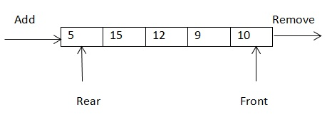
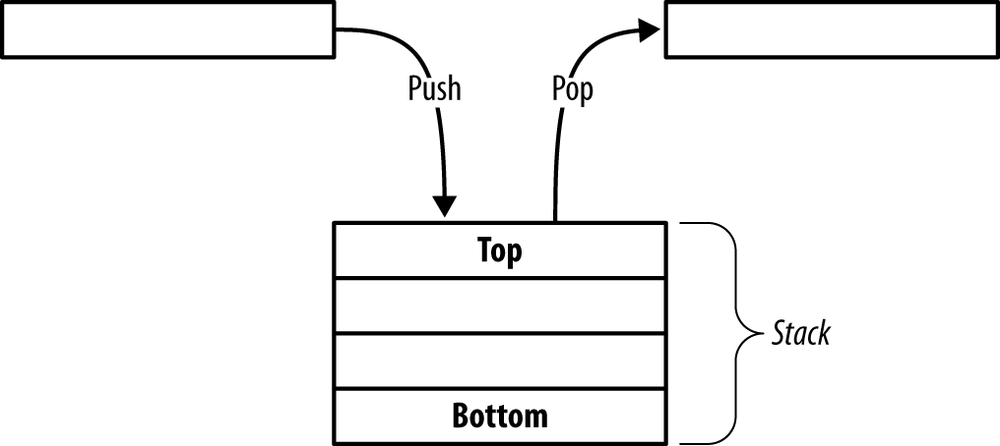
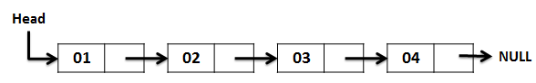
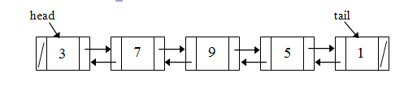
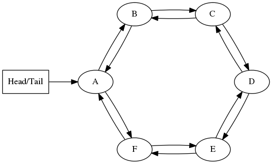

# About this repo 
I'm preparing myself for a whiteboard test. I'm a front-end developer and I don't get to deal with complex data structures on daily basis. I need to try to remember these when I have a technical interview so I decided to document my preparation for the interview so it can save time to other developers 
preparing for a technical interview.

I'm quite confortable with design patterns and object-oriented programming concepts so I will not document those. This document 
focuses on data structures and algorithms (DSA). 

I hope that other developers will find this guide useful when preparing for a technical interview.

# Learning Resources
My two main learning resources are:

- [Data Structures and Algorithms: Annotated Reference with Examples](http://lib.mdp.ac.id/ebook/Karya%20Umum/Dsa.pdf) by Granville Barnett, and Luca Del Tongo
- [Cracking the Coding Interview: 189 Programming Questions and Solutions](http://amzn.to/2btJOH8) by Gayle Laakmann McDowell
- [Big-O Cheat Sheet](http://bigocheatsheet.com/) by Eric Rowell

# Big O notation
Some of the most common Big O notations include:

- O(1) Constant
- O(log n) Logarithmic
- O(n) Linear
- O(n log n) Log linear
- O(n^2) Quadratic
- O(n^3) Cubic
- O(n^n) Exponential

The following diagram represent the preceding Big O notations:

- The X axis to represents the number of items (n) in the data structure.
- The Y axis represents the time (O) required to perform an operation.

Consider trying a different data structure / algorithm if its performance is Quadratic, Cubic or Exponential.

If your algorithm uses a loop, it will be likely to have a linear performance O(n), if you use a loop inside a loop (e.g. traverse a 2D matrix) it will be likely to a quadratic performance O(n^2).

# Data Structures

## Queue
A queue is an ordered list that keeps a reference to its head and tail. The queue is a FIFO structure.
The main difference between a linked list and a queue is that the queue only allow us to add items to 
its tail and remove items from its head.

- Insertion in tail O(1)
- Deletion in head O(1)
- Searching O(n)
- Traversing O(n)

Priority queues insert elements in a position based on its priority level. Some implementations of
priority queue use a heap data structure under the hood so its execution tames are the same as a 
standard queue.

## Stack
Stack is an ordered list of similar data type. Stack is a LIFO structure.  
Both insertion and deletion are allowed at only one end of Stack called Top.

- Insertion in head or tail O(1)
- Deletion head or tail  O(1)
- Searching O(n)
- Traversing O(n)

## Singly linked list
Each node contains a reference to the next node in the list.
To improve performance it is recommended to keep a reference to the first node in the list (head) and the last node in the list (tail).

Singly linked list are good for dynamic resizing and have a constant O(1) performance for head or tail insertion and deletion.

- Insertion in head or tail O(1)
- Insertion between head and tail O(n)
- Deletion head or tail  O(1)
- Deletion between head and tail O(n)
- Searching O(n)
- Traversing O(n)
- Reverse traversal O(n^2)

## Doubly linked list
Each node contains a reference to the next and previous nodes in the list.
To improve performance it is recommended to keep a reference to the first node in the list (head) and the last node in the list (tail).

Doubly linked list are good for dynamic resizing, have a constant O(1) performance for head or tail insertion and deletion and have a better O(n) for reverse traversal operations than singly linked lists O(n^2).

- Insertion in head or tail O(1)
- Insertion between head and tail O(n)
- Deletion head or tail  O(1)
- Deletion between head and tail O(n)
- Searching O(n)
- Traversing O(n)
- Reverse traversal O(n)

Singly and doubly linked list are a good option when you know that you will insert, read or delete from the head or tail of the list. However, they are not a good option when searching, accesing by index or inserting between the tail and head nodes.

## Circular linked list
Another method of implementing a linked list (singly or doubly linked) involves using a circular form so that the last node points back to the first node.

Circular data structure would be more natural when used to represent circular problems (e.g turns in card game).
Circular linked List allow us to traverse the entire list starting from any node and allow as to think about fewer 
special cases when coding (all nodes have a node before and after it). 

However, finding end of list and loop control is harder (no NULL's to mark beginning and end). 

Another problem is that if we point to the start of the list and we want to add/remove an item to the front, we would need to go through the entire list in order to find the last node so that we could keep the linked list hooked up properly. The solution to this problem is to forget about the head reference entirely and just have a tail reference (if we point to just the tail node, it is very very easy to find out the gead node).

- Insertion in head or tail O(1)
- Insertion between head and tail O(n)
- Deletion head or tail  O(1)
- Deletion between head and tail O(n)
- Searching O(n)
- Traversing O(n)
- Reverse traversal O(n)

## Sets
TODO

## Hash table
TODO

## Binary Search Tree (BST)
TODO

## Self-balancing binary search tree (AVL Tree)
TODO

## Graphs
TODO

# Algorithms
TODO

# Questions & Answers
TODO
