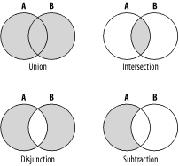

# About this document 
This document focuses on data structures and algorithms (DSA). I'm quite confortable with design patterns and object-oriented programming concepts so I will not document those. 

If you need help to prepare your system design architecture you can refer to the open source [system design interview](https://github.com/checkcheckzz/system-design-interview) guide available on github.

I hope that other developers will find this guide useful when preparing for a technical interview.

# Learning Resources
My main learning resources are:

- [Data Structures and Algorithms: Annotated Reference with Examples](http://lib.mdp.ac.id/ebook/Karya%20Umum/Dsa.pdf) by Granville Barnett, and Luca Del Tongo
- [Cracking the Coding Interview: 189 Programming Questions and Solutions](http://amzn.to/2btJOH8) by Gayle Laakmann McDowell
- [Big-O Cheat Sheet](http://bigocheatsheet.com/) by Eric Rowell

# Big O notation
Some of the most common Big O notations include:

- O(1) Constant
- O(log n) Logarithmic
- O(n) Linear
- O(n log n) Log linear
- O(n^2) Quadratic
- O(n^3) Cubic
- O(n^n) Exponential


The following diagram represent the preceding Big O notations:

- The X axis to represents the number of items (n) in the data structure.
- The Y axis represents the time (O) required to perform an operation.


Consider trying a different data structure / algorithm if its performance is Quadratic, Cubic or Exponential.

If your algorithm uses a loop, it will be likely to have a linear performance O(n), if you use a loop inside a loop (e.g. traverse a 2D matrix) it will be likely to a quadratic performance O(n^2).

# Data Structures

## Stack
Stack is an ordered list of similar data type. Stack is a LIFO structure. Both insertion and deletion are allowed at only one end of Stack called Top.


An stack is good when you need to "do" and "undo" something. Many parsing problems (e.g validate blocks properly closed in a programming language) can be solved using a stack.

- Insertion in head or tail O(1)
- Deletion head or tail  O(1)
- Searching O(n)
- Traversing O(n)

## Singly linked list
Each node contains a reference to the next node in the list.
To improve performance it is recommended to keep a reference to the first node in the list (head) and the last node in the list (tail).


Singly linked list are good for dynamic resizing and have a constant O(1) performance for head or tail insertion and deletion.

- Insertion in head or tail O(1)
- Insertion between head and tail O(n)
- Deletion head or tail  O(1)
- Deletion between head and tail O(n)
- Searching O(n)
- Traversing O(n)
- Reverse traversal O(n^2)

## Doubly linked list
Each node contains a reference to the next and previous nodes in the list.
To improve performance it is recommended to keep a reference to the first node in the list (head) and the last node in the list (tail).


Doubly linked list are good for dynamic resizing, have a constant O(1) performance for head or tail insertion and deletion and have a better O(n) for reverse traversal operations than singly linked lists O(n^2).

- Insertion in head or tail O(1)
- Insertion between head and tail O(n)
- Deletion head or tail  O(1)
- Deletion between head and tail O(n)
- Searching O(n)
- Traversing O(n)
- Reverse traversal O(n)

Singly and doubly linked list are a good option when you know that you will insert, read or delete from the head or tail of the list. However, they are not a good option when searching, accesing by index or inserting between the tail and head nodes.

## Circular linked list
Another method of implementing a linked list (singly or doubly linked) involves using a circular form so that the last node points back to the first node.


Circular data structure would be more natural when used to represent circular problems (e.g turns in card game).
Circular linked List allow us to traverse the entire list starting from any node and allow as to think about fewer 
special cases when coding (all nodes have a node before and after it). 

However, finding end of list and loop control is harder (no NULL's to mark beginning and end). 

Another problem is that if we point to the start of the list and we want to add/remove an item to the front, we would need to go through the entire list in order to find the last node so that we could keep the linked list hooked up properly. The solution to this problem is to forget about the head reference entirely and just have a tail reference (if we point to just the tail node, it is very very easy to find out the head node).

- Insertion in head or tail O(1)
- Insertion between head and tail O(n)
- Deletion head or tail  O(1)
- Deletion between head and tail O(n)
- Searching O(n)
- Traversing O(n)
- Reverse traversal O(n)

## Binary Search Tree (BST)
Binary search trees (BSTs) start with a root node with value x, where the left subtree of x contains nodes with values < x
and the right subtree contains nodes whose values are ≥ x. 

Each node follows the same rules with respect to nodes in their left and right subtrees.


BSTs are of interest because insertion, search, and deletion can all be done in O(log n) time. It is important
to note that the O(log n) times for these operations can only be attained if the BST is reasonably balanced (a pathologically unbalanced tree becomes linear and is effectively just a linked list).

- Insertion O(log n)
- Deletion O(log n)
- Searching O(log n)
- Traversing (Preorder, Postorder, Inorder & Breadth first) O(n)

### BST Deletion
Inserting and searching for a node is very simple but removing an element is not straight forward and requires to consider 3 cases:

- If the node to be removed has no children (leaf node) we just simply remove it.
- Node to be removed has one child. It this case, node is cut from the tree and algorithm links single child (with its subtree) directly to the parent of the removed node.
- Node to be removed has two children. In this case we need to find the minimum value in the right subtree. Replace value of the node to be removed with found minimum. 
Now, right subtree contains a duplicate! Apply remove to the right subtree to remove a duplicate.


### Preorder BST traversal
Then traverse the left subtree and finally traverse the right subtree.


### Postorder BST traversal
The value of the node is yielded after traversing both subtrees.


### Inorder BST traversal
The value of the current node is yielded in between traversing the left subtree and the right subtree


### Breadth first BST traversal
Traversing a tree in breadth first order yields the values of all nodes of a particular depth in the tree before any deeper ones.


## Queue
A queue is an ordered list that keeps a reference to its head and tail. The queue is a FIFO structure.
The main difference between a linked list and a queue is that the queue only allows us to add items to 
its tail and remove items from its head.


- Insertion in tail O(1)
- Deletion in head O(1)
- Searching O(n)
- Traversing O(n)

Priority queues insert elements in a position based on its priority level. Some implementations of
priority queue use a heap data structure under the hood so its execution times are the same as a 
standard queue.

## Heap
A heap is a specialized tree-based data structure that satisfies the heap property. If A is a parent node of B 
then the key (the value) of node A is ordered with respect to the key of node B with the same ordering applying 
across the heap.

The heap can follow two strategies:

- Min heap: each parent node would have a value that is <= than its children.
- Max heap: each parent node would have a value that is > than its children.

Heaps are most commonly used to implement priority queues and to facilitate heap sort.

Unlike other tree data structures a heap is generally implemented as an array rather 
than a series of nodes which each have references to other nodes. 

The nodes are conceptually the same, however, having at most two children.

The following figure shows how the tree (not a heap data structure) would be represented as an array.


The following figure shows how we could implement adding elements to a heap:


There are multiple possible implementations of heaps with different execution times. 
For example, a fibonacci heap has a better running time than many other priority queue data structures 
including the binary heap and binomial heap.


## Sets
A set contains a number of values, in no particular order. The values within
the set are distinct from one another.



It is common to work with multiple sets and perform operations like:

- Insertion O(1)
- Deletion O(1)
- Searching O(1)
- Traversing O(n)
- Union O(n + m) where n and m are the number of items in each set
- Intersection O(n) where n is the number of items in the smallest set
- Disjunction (AKA symmetric difference) O(n) where n is the number of items in the smallest set
- Subtraction O(n) where n is the number of items in right side of the operator

## Hash table
A  hash table (AKA hash map) is a data structure used to implement an associative array, 
a structure that can map keys to values. A hash table uses a hash function to compute 
an index into an array of buckets or slots, from which the desired value can be found.


If the hash function is not powerful enough it can lead to collisions.

- Insertion O(1)
- Deletion O(1)
- Searching O(1) best O(log n) worst (collisions managed via AVL)
- Traversing O(n)

## Self-balancing binary search tree (AVL Tree)
An AVL tree is a BST with an additional condition: the difference between the height 
of the left and righ subtrees cannot be more than one.

- Rotation O(n) 
- Insertion O(log n)
- Deletion O(log n)
- Searching O(log n)
- Traversing O(n)

Insertion/Deletion in AVL tree uses [Single rotation](https://www.youtube.com/watch?v=YKt1kquKScY) 
or [Double rotation](https://www.youtube.com/watch?v=vwVXN9NCWaA) to keep the tree in balance.

## Graphs
A graph data structure consists of a finite (and possibly mutable) set of vertices or nodes or 
points, together with a set of unordered pairs of these vertices for an undirected graph or 
a set of ordered pairs for a directed graph.

A graph can be represented using a matrix:


# Algorithms
The most popular sorting algorithms are:

- Bubble sort O(n^2)

```js
var a = [34, 203, 3, 746, 200, 984, 198, 764, 9];
 
function bubbleSort(a)
{
    var swapped;
    do {
        swapped = false;
        for (var i=0; i < a.length-1; i++) {
            if (a[i] > a[i+1]) {
                var temp = a[i];
                a[i] = a[i+1];
                a[i+1] = temp;
                swapped = true;
            }
        }
    } while (swapped);
}
 
bubbleSort(a);
console.log(a);
```

- Merge sort O(n log n)

```js
/**
 * Merges to arrays in order based on their natural
 * relationship.
 * @param {Array} left The first array to merge.
 * @param {Array} right The second array to merge.
 * @return {Array} The merged array.
 */
function merge(left, right){
    var result  = [],
        il      = 0,
        ir      = 0;

    while (il < left.length && ir < right.length){
        if (left[il] < right[ir]){
            result.push(left[il++]);
        } else {
            result.push(right[ir++]);
        }
    }

    return result.concat(left.slice(il)).concat(right.slice(ir));
}

/**
 * Sorts an array in ascending natural order using
 * merge sort.
 * @param {Array} items The array to sort.
 * @return {Array} The sorted array.
 */
function mergeSort(items){

    if (items.length < 2) {
        return items;
    }

    var middle = Math.floor(items.length / 2),
        left    = items.slice(0, middle),
        right   = items.slice(middle),
        params = merge(mergeSort(left), mergeSort(right));
    
    // Add the arguments to replace everything between 0 and last item in the array
    params.unshift(0, items.length);
    items.splice.apply(items, params);
    return items;
}
```

- Quick sort O(n log n)

```js
/**
 * Swaps two values in an array.
 * @param {Array} items The array containing the items.
 * @param {int} firstIndex Index of first item to swap.
 * @param {int} secondIndex Index of second item to swap.
 * @return {void}
 */
function swap(items, firstIndex, secondIndex){
    var temp = items[firstIndex];
    items[firstIndex] = items[secondIndex];
    items[secondIndex] = temp;
}

function partition(items, left, right) {

    var pivot   = items[Math.floor((right + left) / 2)],  // pivot value is middle item
        i       = left,     // starts from left and goes right to pivot index
        j       = right;    // starts from right and goes left to pivot index


    // while the two indices don't match
    while (i <= j) {

        // if the item on the left is less than the pivot, continue right
        while (items[i] < pivot) {
            i++;
        }

        // if the item on the right is greater than the pivot, continue left
        while (items[j] > pivot) {
            j--;
        }

        // if the two indices still don't match, swap the values
        if (i <= j) {
            swap(items, i, j);

            // change indices to continue loop
            i++;
            j--;
        }
    }

    // this value is necessary for recursion
    return i;
}

/**
 * A quicksort implementation in JavaScript. The array
 * is sorted in place.
 * @param {Array} items An array of items to sort.
 * @return {Array} The sorted array.
 */
function quickSort(items, left, right) {

    var index;

    // performance - don't sort an array with zero or one items
    if (items.length > 1) {

        // fix left and right values - might not be provided
        left = typeof left != "number" ? 0 : left;
        right = typeof right != "number" ? items.length - 1 : right;

        // split up the entire array
        index = partition(items, left, right);

        // if the returned index
        if (left < index - 1) {
            quickSort(items, left, index - 1);
        }

        if (index < right) {
            quickSort(items, index, right);
        }

    }

    return items;
}

```

- Insertion sort O(n ^ 2)

```js
/**
 * An insertion sort implementation in JavaScript. The array
 * is sorted in-place.
 * @param {Array} items An array of items to sort.
 * @return {Array} The sorted array.
 */
function insertionSort(items) {

    var len     = items.length,     // number of items in the array
        value,                      // the value currently being compared
        i,                          // index into unsorted section
        j;                          // index into sorted section
    
    for (i=0; i < len; i++) {
    
        // store the current value because it may shift later
        value = items[i];
        
        /*
         * Whenever the value in the sorted section is greater than the value
         * in the unsorted section, shift all items in the sorted section over
         * by one. This creates space in which to insert the value.
         */
        for (j=i-1; j > -1 && items[j] > value; j--) {
            items[j+1] = items[j];
        }

        items[j+1] = value;
    }
    
    return items;
}
```

We should try to aim for quick sort.


The most popular searching algorithms are:

- Sequential search
- Probability search

# Numbers
Here you can find some common questions about numbers.

## Implement a Fibonacci sequence using recursive and sequentialal gorithms

The pattern of the Fibonacci sequence is that each value is the sum of the 2 previous values:

```
F(n) = F(n-1) + F(n-2)
```

Sequential (Basic) O(n):

```js
function fibonacci(num){
  var a = 1, b = 0, temp;

  while (num >= 0){
    temp = a;
    a = a + b;
    b = temp;
    num--;
  }

  return b;
}
```

Recuersive O(2^n):

```js
function fibonacci(num) {
  if (num <= 1) return 1;

  return fibonacci(num - 1) + fibonacci(num - 2);
}
```

Recuersive (Optimized via Memoization) O(2*n):

```js
function fibonacci(num, memo) {
  memo = memo || {};

  if (memo[num]) return memo[num];
  if (num <= 1) return 1;

  return memo[num] = fibonacci(num - 1, memo) + fibonacci(num - 2, memo);
}
```

## Determine if a given number is prime
> A prime number (or a prime) is a natural number greater 
> than 1 that has no positive divisors other than 1 and itself.

```js
function isPrime(number) {
    var start = 2;
    while (start <= Math.sqrt(number)) {
        start = start + 1;
        if ((number % start) < 1) return false;
    }
    return number > 1;
}
```

## Translate a number into binary
```js
function dec2bin(dec) {
    return (dec >>> 0).toString(2);
}
```

## Find the greatest common denominator
> The greatest common divisor (gcd) of two or more integers, 
> when at least one of them is not zero, is the largest positive integer that divides the numbers without a remainder.

```js
var gcd = function(a, b) {
    if (!b) {
        return a;
    }
    return gcd(b, a % b);
};
```

## Calculate the factorial of a number
> The factorial of a non-negative integer (n) is the product of all 
> positive integers less than or equal to n.

```js
function fact(x) {
   if(x==0) {
      return 1;
   }
   return x * fact(x-1);
}
```

## Romanize a number
```js
function romanize(num) {
  var lookup = {M:1000,CM:900,D:500,CD:400,C:100,XC:90,L:50,XL:40,X:10,IX:9,V:5,IV:4,I:1},roman = '',i;
  for ( i in lookup ) {
    while ( num >= lookup[i] ) {
      roman += i;
      num -= lookup[i];
    }
  }
  return roman;
}
```
